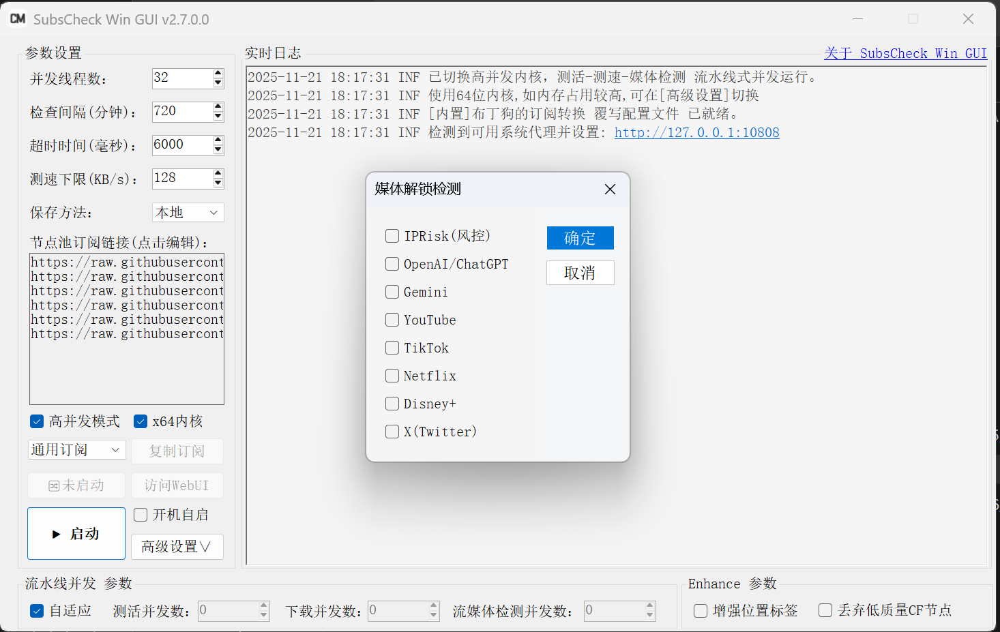

# 🚀 SubsCheck-Win-GUI

> ✨ 修复界面模糊，支持高DPI缩放，增加自适应高并发内核切换，增加`i386/64`位内核切换，优化自动更新，增加了新的参数设置项。
> 新增：“系统代理”设置，支持系统代理自动检测并设置。

> 内核新增功能详见：[sinspired/subs-check](https://github.com/sinspired/subs-check)

- **视频教程：[永久免费0门槛！小白也有无限高速代理节点！](https://youtu.be/sS9Tuf1PCyc)**
- **数字签名：[关于项目报毒说明](https://www.youtube.com/watch?v=4906t5zygAE&t=123s)**
- **Telegram交流群：[@CMLiussss](https://t.me/CMLiussss)**

# ⚠️ 免责声明

本项目仅供学习、研究与安全测试使用，请勿用于任何非法活动。使用前请确保您已了解并遵守所在地的法律法规。

### 📋 使用条款

- **教育与研究用途**：本软件仅可用于网络技术和编程领域的学习、研究和安全测试。
- **禁止非法使用**：严禁将 **SubsCheck-Win-GUI** 用于任何非法活动或违反使用者所在地区法律法规的行为。
- **使用时限**：基于学习和研究目的，建议用户在完成研究或学习后，或在安装后的**24小时内，删除本软件及所有相关文件。**
- **免责声明**：**SubsCheck-Win-GUI** 的创建者和贡献者不对因使用或滥用本软件而导致的任何损害或法律问题负责。
- **用户责任**：**用户对使用本软件的方式以及由此产生的任何后果完全负责。**
- **无技术支持**：本软件的创建者不提供任何技术支持或使用协助。
- **知情同意**：使用 **SubsCheck-Win-GUI** 即表示您已阅读并理解本免责声明，并同意受其条款的约束。

> [!WARNING]
> **请记住**：本软件的主要目的是促进学习、研究和安全测试。作者不支持或认可任何其他用途。使用者应当在合法和负责任的前提下使用本工具。

---



## 🖥️ 系统要求

- **操作系统**: Windows 10/11 (32位/64位)
- **.NET 框架**: .NET Framework 4.7.2 或更高版本

> [!CAUTION]
> **系统兼容性说明**: 本软件不支持Windows 7及更早版本。因为核心组件subs-check使用Go语言编译，而Go 1.19及以后版本已正式放弃对Windows 7的支持。

## 💾 测速结果 保存方法

- **本地**：将结果保存到本地,默认保存到可执行文件目录下的 output 文件夹
- **r2**：将结果保存到 cloudflare r2 存储桶 [配置方法](https://github.com/beck-8/subs-check/blob/master/doc/r2.md)
- **gist**：将结果保存到 github gist [配置方法](https://github.com/beck-8/subs-check/blob/master/doc/gist.md)
- **webdav**：将结果保存到 webdav 服务器 [配置方法](https://github.com/beck-8/subs-check/blob/master/doc/webdav.md)

## 📦 关于 Github Proxy

- **Github Proxy**：本项目使用了 `Github Proxy` 来加速 GUI 必要内容的加载。

> [!Tip]
> 你也可以通过 <https://github.com/cmliu/CF-Workers-GitHub> 项目来搭建自己专属的 **Github Proxy**。

## 📁 GUI 文件结构

```shell
subs-check.win.gui.exe       # GUI本体
subs-check.exe               # subs-check x86_32位 内核本体  
subs-check_Windows_i386.zip  # subs-check x86_32位 内核压缩包  
# Upgrade.exe           # 升级程序（已使用AutoUpdater替换）
# Upgrade.ini           # 升级配置文件（已使用AutoUpdater替换）
config
 ├─ config.yaml              # subs-check 配置文件  
 └─ more.yaml                # 补充YAML参数配置文件  
output
 ├─ ACL4SSR_Online_Full.yaml # ACL4SSR_Online_Full.yaml 覆写配置文件
 ├─ all.yaml                 # yaml格式 上次成功测试结果
 ├─ history.yaml             # yaml格式 历次成功测试结果
 ├─ base64.txt               # base64格式 测试结果
 ├─ bdg.yaml                 # 布丁狗的订阅转换.yaml 覆写配置文件
 ├─ mihomo.yaml              # clash订阅文件 带分流规则
 ├─ node.exe                 # sub-store 服务
 ├─ root.json                # sub-store 配置文件
 ├─ sub-store.bundle.js      # sub-store js文件
 ├─ sub-store.json           # sub-store json文件
 └─ sub-store.log            # sub-store 日志
Newtonsoft.Json.dll          # 验证版本信息组件
YamlDotNet.dll               # yaml读写组件
# AutoUpdater 依赖和语言支持
AutoUpdater.NET.dll
Microsoft.Web.WebView2.Core.dll
Microsoft.Web.WebView2.WinForms.dll   
runtimes\
zh\                          # 中文语言包
```

## ⭐ Star 星星走起

[](https://starchart.cc/cmliu/SubsCheck-Win-GUI)

## 💻 已适配客户端

- [v2rayN](https://github.com/2dust/v2rayN)
- [mihomo-party](https://github.com/mihomo-party-org/mihomo-party)，[FlClash](https://github.com/chen08209/FlClash)，[clash-verge-rev](https://github.com/clash-verge-rev/clash-verge-rev)，[Clash Nyanpasu](https://github.com/keiko233/clash-nyanpasu)

# 🙏 致谢

[beck-8](https://github.com/beck-8/subs-check)、[bestruirui](https://github.com/bestruirui/BestSub)、[Sub-Store](https://github.com/sub-store-org/Sub-Store)、GPT
