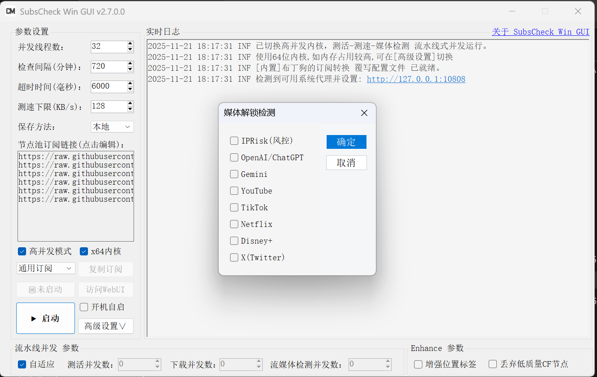

# 🚀 SubsCheck-Win-GUI

[](https://github.com/sinspired/subs-check-pro-gui/releases)
[](https://github.com/sinspired/subs-check-pro/releases/latest)

> [!CAUTION]
>请访问 https://github.com/sinspired/subs-check-pro-gui 下载最新的跨平台现代桌面端程序；本仓库将停止维护！

本项目基于CM的大量工作，已提PR。支持高并发内核切换，支持64位；支持高dpi显示器，解决界面字体模糊等问题；添加下载大小限制，降低节点被测死的概率；新内核支持一键管理 `sub-store`

## ✨ 新增功能

- [x] 🖥️ 修复界面模糊，支持 **高 DPI 缩放**  
- [x] ⚡ 自动检测并设置系统代理  
- [x] 🔄 增加 **自适应高并发内核切换**，减少无谓的生命浪费
- [x] 🧩 增加 **i386/64 位内核切换**  
- [x] 🔧 新增 **性能版内核参数**  
- [x] 🚀 优化 **自动更新机制**
- [x] 🌐 现代化 WebUI，优化移动端访问体验  
- [x] 🛠️ 一键管理 `**sub-store**`
- [x] 📊 统计订阅链接总数、可用节点数量、成功率  
- [x] ✅ 添加媒体解锁平台 多选窗口
- [x] 📡 支持检测 isp 类型，原生/广播IP，住宅/机房等，节点添加类似 `[原生|住宅]` 的标签
- [ ] 🌙 支持深色模式

> [!TIP]
> 功能更新频繁，请务必查看最新的 [配置文件示例](https://github.com/sinspired/subs-check/blob/main/config/config.example.yaml) 以获取最新功能支持。

- **内核地址**：[subs-check 性能版，支持 Docker 部署](https://github.com/sinspired/subs-check)  
- **Telegram 交流群**：[@Sinspired](https://t.me/subs_check_pro)

## ⚠️ 免责声明

本项目仅供 **学习、研究与安全测试** 使用，请勿用于任何非法活动。使用前请确保您已了解并遵守所在地的法律法规。

### 📋 使用条款

- **教育与研究用途**：仅限学习、研究和安全测试  
- **禁止非法使用**：严禁用于违法行为  
- **使用时限**：建议安装后 **24 小时内删除**  
- **免责声明**：作者不对任何损害或法律问题负责  
- **用户责任**：用户需自行承担使用后果  
- **无技术支持**：作者不提供技术支持  
- **知情同意**：使用即表示同意上述条款  

> [!WARNING]  
> 本软件的主要目的是促进学习、研究和安全测试。请在合法和负责任的前提下使用。



## 🖥️ 系统要求

- **操作系统**: Windows 10/11 (32位/64位)  
- **.NET 框架**: .NET Framework 4.7.2 或更高版本  

> [!CAUTION]  
> 不支持 Windows 7 及更早版本（Go 1.19+ 已放弃支持）。

## 💾 测速结果保存方式

- **本地**：保存到 `output` 文件夹  
- **r2**：保存到 Cloudflare R2 存储桶 → [配置方法](https://github.com/sinspired/subs-check/blob/master/doc/r2.md)  
- **gist**：保存到 GitHub Gist → [配置方法](https://github.com/sinspired/subs-check/blob/master/doc/gist.md)  
- **webdav**：保存到 WebDAV 服务器 → [配置方法](https://github.com/sinspired/subs-check/blob/master/doc/webdav.md)  

## 📦 Github Proxy

本项目使用 `Github Proxy` 加速 GUI 必要内容加载。  
你也可以通过 [CF-Workers-GitHub](https://github.com/cmliu/CF-Workers-GitHub) 搭建自己的代理。

## 📁 文件结构

```shell
subs-check.win.gui.exe       # GUI 主程序
subs-check.exe               # subs-check x86_32 内核
subs-check_Windows_i386.zip  # subs-check 内核压缩包
config/
 ├─ config.yaml              # 主配置文件
 └─ more.yaml                # 补充参数配置文件
output/
 ├─ all.yaml                 # 上次成功测试结果
 ├─ history.yaml             # 历次成功测试结果
 ├─ base64.txt               # Base64 格式结果
 ├─ mihomo.yaml              # Clash 订阅文件
 ├─ sub-store.*              # sub-store 相关文件
 └─ sub-store.log            # sub-store 日志
AutoUpdater.NET.dll          # 自动更新依赖
Microsoft.Web.WebView2.*     # WebView2 组件
Newtonsoft.Json.dll          # JSON 组件
YamlDotNet.dll               # YAML 组件
```

## ⭐ Star 星星走起

[](https://starchart.cc/cmliu/SubsCheck-Win-GUI)

## 💻 已适配客户端

- [v2rayN](https://github.com/2dust/v2rayN)
- [singbox](https://github.com/SagerNet/sing-box)
- [mihomo-party](https://github.com/mihomo-party-org/mihomo-party)，[FlClash](https://github.com/chen08209/FlClash)，[clash-verge-rev](https://github.com/clash-verge-rev/clash-verge-rev)，[Clash Nyanpasu](https://github.com/keiko233/clash-nyanpasu)

## 🙏 致谢

[beck-8](https://github.com/beck-8/subs-check)、[bestruirui](https://github.com/bestruirui/BestSub)、[Sub-Store](https://github.com/sub-store-org/Sub-Store)、GPT
